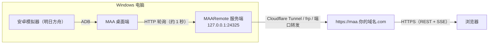

# MAARemote — MAA 桌面端远程监控 WebApp

> 本文只使用示例地址和占位符。真实 token、域名、Tunnel UUID、凭据路径和设备标识符只应保存在本机，绝不要提交到 Git 或粘贴到公开渠道。

为 Windows 上的 [MAA 桌面端](https://github.com/MaaAssistantArknights/MaaAssistantArknights)（明日方舟助手）实现官方**远程控制协议**的服务端：监控任务进度、实时截图，并支持远程下发指令。前端仪表盘（移动端优先，任意现代浏览器访问）由本人另行设计实现，对接本项目提供的 API。

## 架构



MAA 桌面端在「设置 → 远程控制」中填入本服务端的两个端点后，会以约 1 秒间隔轮询取任务、完成即回报——服务端由此获知在线状态与任务生命周期，并通过下发 `HeartBeat` / `CaptureImageNow` 等任务实现当前任务探测与截图采集。

## 功能

- 实现 MAA 官方远程控制协议两端点（`getTask` / `reportStatus`），幂等可重入、超时回收（防 MAA 重启后任务重复执行）
- 设备管理：user 密钥校验（403）、未知设备 401 待人工批准
- 任务状态机：`queued → dispatched → running → success/failed`（超时 → `stale`）
- 心跳注入：周期下发 `HeartBeat` 探测当前正在执行的任务
- 截图采集：周期/手动下发 `CaptureImageNow`，Base64 落盘 + 保留策略
- 指令下发：`LinkStart` 及各子功能、`StopTask`、`Toolbox-Gacha*`、`Settings-*`
- 仪表盘 API：总览 / SSE 实时事件流 / 任务历史 / 截图 / 设备批准，`dashboardToken` 鉴权

## 环境要求

- Windows，Node.js ≥ 18（开发验证于 v24）
- **PowerShell 7（pwsh.exe）**——本项目所有命令统一通过 `pwsh -NoProfile -Command` 执行

## 快速开始（本机联调）

### 1. 启动服务

```powershell
# 一键启动：自动安装依赖、检测端口占用、前台运行（Ctrl+C 优雅退出）
pwsh -NoProfile -File .\start.ps1

# 或手动等价方式：
cd server
npm install
node src/index.js
```

首次运行自动生成 `server/config.json`（含随机 token，已被 `.gitignore` 忽略，勿提交）。

### 2. 接入 MAA

在 MAA「设置 → 远程控制」填入：

| 配置项 | 值 |
|---|---|
| 获取任务端点 | `http://127.0.0.1:24325/maa/getTask`（联调）或 `https://maa.你的域名.com/maa/getTask` |
| 汇报任务端点 | 同上，路径为 `/maa/reportStatus` |
| 用户标识符 | `config.json` 中的 `maaUserToken` |

设备标识符在 MAA 界面复制；首次连接返回 401，调用 `POST /api/devices/:id/approve`（带 `dashboardToken`）批准后放行。

### 3. 公网接入

推荐使用 Cloudflare Tunnel。安装并登录 `cloudflared`，创建自己的 Tunnel 和 DNS 记录，再按 [deploy/cloudflared-config.yml](deploy/cloudflared-config.yml) 中的占位符配置转发到 `http://127.0.0.1:24325`。随后把 MAA 两个端点改为 `https://<你的域名>/maa/getTask` 与 `https://<你的域名>/maa/reportStatus`。完整常驻步骤见 [DEPLOY.md](DEPLOY.md)。

没有域名时也可以使用 FRP：让有公网 IP 的服务器运行 `frps`，Windows 主机运行 `frpc`，将 `127.0.0.1:24325` 转发到公网端口。以下示例**目前未经过本项目实机测试**：

```toml
# frps.toml（公网服务器）
bindPort = 7000
auth.method = "token"
auth.token = "<服务端随机值>"
```

```toml
# frpc.toml（Windows 主机）
serverAddr = "<公网服务器 IP>"
serverPort = 7000
auth.method = "token"
auth.token = "<与 frps 相同的本机秘密>"

[[proxies]]
name = "maa-remote"
type = "tcp"
localIP = "127.0.0.1"
localPort = 24325
remotePort = 24325
```

启动两端后，使用 `http://<公网服务器 IP>:24325/maa/getTask` 和对应的 `/maa/reportStatus`。FRP 直连通常没有 HTTPS，生产使用前应增加 TLS 反向代理和访问控制。真实地址与密钥不要提交到 Git。

## 部署（公网访问）

完整步骤见 **[DEPLOY.md](DEPLOY.md)**，要点：

1. **服务常驻**：日常用 `start.ps1` 前台运行；长期挂机推荐系统托盘 `pwsh -NoProfile -File tray.ps1`（右键菜单启停/重启/开机自启，命令行 `tray.ps1 -Action start|stop|restart|status|autostart-on|autostart-off` 同效，见 DEPLOY.md §6），并把电源计划设为不休眠。
2. **公网接入（推荐 Cloudflare Tunnel）**：`winget install Cloudflare.cloudflared` → `cloudflared tunnel login`（浏览器授权）→ `tunnel create` → `tunnel route dns`（绑定你的子域名）→ 按 `deploy\cloudflared-config.yml` 示例放置配置与凭据 → `cloudflared service install`。全程**零防火墙入站规则**（服务仅监听 127.0.0.1，cloudflared 只做出站连接），HTTPS 由 Cloudflare 自动终结。
3. **MAA 接入**：MAA「设置 → 远程控制」两个端点填 `https://<你的域名>/maa/getTask` 与 `.../maa/reportStatus`，用户标识符填 `config.json` 的 `maaUserToken`；首次连接 401 后在仪表盘「待批准设备」中核对设备标识符并批准（见上方 API）。

## API 一览

**MAA 协议端**（见[官方协议文档](https://docs.maa.plus/zh-cn/protocol/remote-control-schema.html)）：

| 方法 | 路径 | 说明 |
|---|---|---|
| POST | `/maa/getTask` | MAA 轮询取任务，响应 `{"tasks":[...]}` |
| POST | `/maa/reportStatus` | MAA 回报任务结果（截图 payload 为 Base64） |

**仪表盘端**（均需 `Authorization: Bearer <dashboardToken>`）：

| 方法 | 路径 | 说明 |
|---|---|---|
| GET | `/api/overview` | 设备在线状态 + 当前任务 + 最近事件 |
| GET | `/api/events` | SSE 实时事件流 |
| GET | `/api/tasks?limit=50` | 任务历史 |
| POST | `/api/tasks` | 下发指令 `{type, params?}` |
| GET | `/api/screenshots?limit=20` | 截图列表 |
| GET | `/api/screenshots/:id` | 截图文件 |
| GET | `/api/devices/pending` | 待批准设备 |
| POST | `/api/devices/:id/approve` | 批准设备 |

## 配置项（server/config.json）

| 字段 | 默认 | 说明 |
|---|---|---|
| `port` | `24325` | 监听端口 |
| `maaUserToken` | 随机生成 | MAA「用户标识符」要填的共享密钥 |
| `dashboardToken` | 随机生成 | 仪表盘 API 鉴权令牌 |
| `heartbeatIntervalSec` | `30` | HeartBeat 注入间隔 |
| `screenshotIntervalSec` | `300` | 截图采集间隔 |
| `staleMinutes` | `10` | dispatched 无回报判定超时 |
| `screenshotKeepCount` | `50` | 截图保留张数 |
| `offlineAfterSec` | `5` | 无轮询判定离线阈值 |

## 仓库结构

```
start.ps1         一键启动（安装依赖 + 端口检测 + 前台运行）
tray.ps1          系统托盘常驻 + 命令行启停（开机自启，见 DEPLOY.md §6）
DEPLOY.md         部署指南（Cloudflare Tunnel / 托盘与 NSSM 常驻 / MAA 接入 / 故障排查）
server/           后端（Node.js + Fastify + SQLite）
  src/            入口、路由、调度器
  data/           运行时生成：maa.db、screenshots/（已忽略）
  tools/          mock-maa.js 模拟客户端（自测用）
deploy/           cloudflared 隧道配置示例
web/              前端（AGPL-3.0-or-later）
实现报告.md        方案设计权威文档
LICENSE           后端 MPL-2.0
web/LICENSE       前端 AGPL-3.0-or-later
```

## 致谢

- [MaaAssistantArknights](https://github.com/MaaAssistantArknights/MaaAssistantArknights) —— MAA 桌面端及其公开的远程控制协议，本项目因它而生；
- [GLM-5.3 家族（Z.ai）](https://z.ai) —— 本项目的方案研究与全部代码实现由 GLM-5.3 / GLM-5.3-Flash 与作者协作完成。
- [Home Assistant Demo Dashboard](https://demo.home-assistant.io/#/lovelace/home) —— 仪表盘信息架构与卡片式家庭自动化控制界面提供了 UI 设计参考。
- [OpenAI](https://openai.com/) —— GPT-5.6 家族与 GPT-6 Astra 参与了本项目的研究、实现与文档整理。

## 许可证

- `server/` 后端代码采用 [MPL-2.0](LICENSE)。
- `web/` 前端代码采用 [GNU AGPL-3.0-or-later](web/LICENSE)。
- 本项目是 MAA 官方远程控制协议的独立实现，未复制或链接 MAA 代码；MAA 及其商标归其各自权利人所有。
