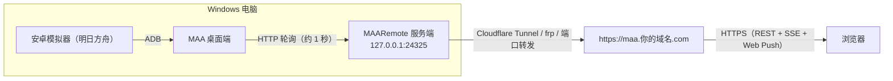

# MAARemote — MAA 桌面端远程监控 WebApp

> 本文只使用示例地址和占位符。真实 token、域名、Tunnel UUID、凭据路径和设备标识符只应保存在本机，绝不要提交到 Git 或粘贴到公开渠道。

前端代码采用 **AGPL-3.0-or-later**；后端代码采用 **MPL-2.0**。公网部署时请自行保管 `dashboardToken` 与 `maaUserToken`，不要把真实 token 提交到仓库。`server/config.json` 已列入 `.gitignore`，只应保留在本机。

为 Windows 上的 [MAA 桌面端](https://github.com/MaaAssistantArknights/MaaAssistantArknights)（明日方舟助手）实现官方**远程控制协议**的服务端：监控任务进度、实时截图，并支持远程下发指令。前端仪表盘（移动端优先，任意现代浏览器访问）由本人另行设计实现，对接本项目提供的 API。

## 架构



MAA 桌面端在「设置 → 远程控制」中填入本服务端的两个端点后，会以约 1 秒间隔轮询取任务、完成即回报——服务端由此获知在线状态与任务生命周期，并通过下发 `HeartBeat` / `CaptureImageNow` 等任务实现当前任务探测与截图采集。

## 功能

- 实现 MAA 官方远程控制协议两端点（`getTask` / `reportStatus`），幂等可重入、超时回收（防 MAA 重启后任务重复执行）
- 设备管理：user 密钥校验（403）、未知设备 401 待人工批准
- 任务状态机：`queued → dispatched → running → success/failed`（超时 → `stale`）
- 心跳注入：周期下发 `HeartBeat` 探测当前正在执行的任务
- 截图采集：周期/手动下发 `CaptureImageNow`，Base64 落盘 + 保留策略
- 指令下发：`LinkStart` 及各子功能、`StopTask`、`Toolbox-Gacha*`、`Settings-*`
- 仪表盘 API：总览 / SSE 实时事件流 / 任务历史 / 截图 / 设备批准，`dashboardToken` 鉴权
- 任务完成通知：`task_finished` 触发浏览器通知（任务名称、成功/失败、任务级耗时）；权限由用户点击开启，同一任务不重复通知，页面打开时即可使用。**后台 Web Push 是可选功能**（主屏幕 Web App、页面关闭时也能收到），需要 HTTPS 并由用户在设置中手动开启；订阅、VAPID 密钥与去重状态保存在 server/data/push.json，不新增 SQLite 表、字段或运行依赖

## 环境要求

- Windows，Node.js ≥ 18（开发验证于 v24）
- **PowerShell 7（pwsh.exe）**——本项目所有命令统一通过 `pwsh -NoProfile -Command` 执行
- 仅支持 Windows：托盘、计划任务守护和推送存储文件的权限收紧（icacls）都依赖 Windows；双击入口（*.cmd）调用 pwsh.exe

## 快速开始（本机联调）

### 1. 启动服务

```powershell
# 一键启动：按需准备依赖、检测端口占用、前台运行（Ctrl+C 优雅退出）
pwsh -NoProfile -File .\start.ps1

# 或手动启动（要求依赖已经准备）：
cd server
node src/index.js
```

首次运行自动生成 `server/config.json`（含随机 token，已被 `.gitignore` 忽略，勿提交）。

### 2. 接入 MAA

在 MAA「设置 → 远程控制」填入：

| 配置项 | 值 |
|---|---|
| 获取任务端点 | `http://127.0.0.1:24325/maa/getTask`（联调）或 `https://maa.你的域名.com/maa/getTask` |
| 汇报任务端点 | 同上，路径为 `/maa/reportStatus` |
| 用户标识符 | `config.json` 中的 `maaUserToken` |

设备标识符在 MAA 界面复制；首次连接返回 401，调用 `POST /api/devices/:id/approve`（带 `dashboardToken`）批准后放行。

### 3. 公网接入

推荐使用 Cloudflare Tunnel。安装并登录 `cloudflared`，创建自己的 Tunnel 和 DNS 记录，再按 [deploy/cloudflared-config.yml](deploy/cloudflared-config.yml) 中的占位符配置转发到 `http://127.0.0.1:24325`。随后把 MAA 两个端点改为 `https://<你的域名>/maa/getTask` 与 `https://<你的域名>/maa/reportStatus`。完整常驻步骤见 [DEPLOY.md](DEPLOY.md)。

没有域名时也可以使用 FRP：让有公网 IP 的服务器运行 `frps`，Windows 主机运行 `frpc`，将 `127.0.0.1:24325` 转发到公网端口。以下示例**目前未经过本项目实机测试**：

```toml
# frps.toml（公网服务器）
bindPort = 7000
auth.method = "token"
auth.token = "<服务端随机值>"
```

```toml
# frpc.toml（Windows 主机）
serverAddr = "<公网服务器 IP>"
serverPort = 7000
auth.method = "token"
auth.token = "<与 frps 相同的本机秘密>"

[[proxies]]
name = "maa-remote"
type = "tcp"
localIP = "127.0.0.1"
localPort = 24325
remotePort = 24325
```

启动两端后，使用 `http://<公网服务器 IP>:24325/maa/getTask` 和对应的 `/maa/reportStatus`。FRP 直连通常没有 HTTPS，生产使用前应增加 TLS 反向代理和访问控制。真实地址与密钥不要提交到 Git。

## 部署（公网访问）

> 公网访问策略：仪表盘和 /api/* 由 Cloudflare Access 的 Allow 策略加 dashboardToken 双层保护，未登录访问返回 302；/api/push/* 不对匿名用户开放。若使用可选的 iPhone 后台推送且整站被 Access 保护，需让 /sw.js、/manifest.webmanifest 和两个图标匿名可读（可选的边缘 Worker 方案见 DEPLOY.md §10）。

完整步骤见 **[DEPLOY.md](DEPLOY.md)**，要点：

1. **核心启动路径**：真正承接 MAA 轮询的是 Node 服务；`web/` 前端由同一个 Fastify 进程托管，不是第二个需要单独启动的前端服务。最小路径是 `start.ps1` → Node 服务 → 浏览器访问仪表盘。
2. **可选桌面层**：`tray.ps1` 只是托盘管理界面和命令行工具，需要桌面管理时再启动；`tray-guard.ps1` 加 Windows 计划任务是更进一步的可选守护，只监督托盘，不管理 Node 服务。两者都默认关闭，不是项目运行前置条件。托盘的 Run 键自启与计划任务守护互斥，同一时间只启用一种，详见 DEPLOY.md §6。
3. **公网接入（推荐 Cloudflare Tunnel）**：`winget install Cloudflare.cloudflared` → `cloudflared tunnel login`（浏览器授权）→ `tunnel create` → `tunnel route dns`（绑定你的子域名）→ 按 `deploy\cloudflared-config.yml` 示例放置配置与凭据 → `cloudflared service install`。全程**零防火墙入站规则**（服务仅监听 127.0.0.1，cloudflared 只做出站连接），HTTPS 由 Cloudflare 自动终结。
4. **MAA 接入**：MAA「设置 → 远程控制」两个端点填 `https://<你的域名>/maa/getTask` 与 `.../maa/reportStatus`，用户标识符填 `config.json` 的 `maaUserToken`；首次连接 401 后在仪表盘「待批准设备」中核对设备标识符并批准（见上方 API）。

> 托盘守护（`tray-guard.ps1` 加 Windows 计划任务）是可选功能，默认关闭，不是运行前置条件；安装、状态和回滚见 DEPLOY.md §6.2。右键以管理员身份运行 `安装 MAARemote 托盘守护.cmd` 可一键安装，该入口不会启动托盘或 Node 服务。

## API 一览

**MAA 协议端**（见[官方协议文档](https://docs.maa.plus/zh-cn/protocol/remote-control-schema.html)）：

| 方法 | 路径 | 说明 |
|---|---|---|
| POST | `/maa/getTask` | MAA 轮询取任务，响应 `{"tasks":[...]}` |
| POST | `/maa/reportStatus` | MAA 回报任务结果（截图 payload 为 Base64） |

**仪表盘端**（均需 `Authorization: Bearer <dashboardToken>`）：

| 方法 | 路径 | 说明 |
|---|---|---|
| GET | `/api/overview` | 设备在线状态 + 当前任务 + 最近事件 |
| GET | `/api/events` | SSE 实时事件流 |
| GET | `/api/tasks?limit=50` | 任务历史 |
| POST | `/api/tasks` | 下发指令 `{type, params?}`；`LinkStart*` 同类型未终结（或心跳仍观测到同类型占用）时拒绝 |
| GET | `/api/screenshots?limit=20` | 截图列表 |
| GET | `/api/screenshots/:id` | 截图文件 |
| GET | `/api/devices/pending` | 待批准设备 |
| POST | `/api/devices/:id/approve` | 批准设备 |

## 配置项（server/config.json）

| 字段 | 默认 | 说明 |
|---|---|---|
| `port` | `24325` | 监听端口 |
| `maaUserToken` | 随机生成 | MAA「用户标识符」要填的共享密钥 |
| `dashboardToken` | 随机生成 | 仪表盘 API 鉴权令牌 |
| `heartbeatIntervalSec` | `30` | HeartBeat 注入间隔 |
| `screenshotIntervalSec` | `300` | 截图采集间隔 |
| `staleMinutes` | `10` | dispatched / running 超过该时间无终结回报则判定超时。HeartBeat 仍观测到的任务会刷新该计时，长任务不会只因跑过 10 分钟被误标 |
| `screenshotKeepCount` | `50` | 截图保留张数 |
| `offlineAfterSec` | `5` | 无轮询判定离线阈值 |

## 任务完成通知与后台推送（后台推送为可选功能）

- 页面通知：默认可用，无需配置。页面打开时通知任务名称、成功/失败和任务级耗时，同一任务只通知一次。
- 后台 Web Push（可选）：页面关闭或手机锁屏时也能收到。需要 HTTPS；iPhone 需 iOS 16.4 及以上，并先把页面添加到主屏幕，再在 Web App 的「设置与工具」点击「开启后台推送」。不开启不影响其他任何功能。
- 开箱即用：Service Worker、manifest 和图标已放在 web/，由 Node 服务同源提供，只要能通过 HTTPS 访问就能登记订阅。服务端只在 task_finished 时推送，内容仅含任务名称、结果和耗时，用 Node 内置 HTTPS 投递，不新增运行依赖。
- 推送由 Apple、Google 或 Mozilla 的 Push Service 投递，属于尽力而为，可能延迟、合并或丢弃。
- 只有「整站被 Cloudflare Access 登录保护」时才需要额外步骤：iOS 注册 Service Worker 不能遇到登录重定向，这时可选择部署 [cloudflare/p4b-assets/](cloudflare/p4b-assets/README.md) 的边缘 Worker，让这四个不含秘密的文件匿名可读，见 DEPLOY.md §10。

## 仓库结构

```
start.ps1         核心启动入口（按需准备依赖 + 端口检测 + 前台运行）
tray.ps1          可选系统托盘 + 命令行启停（需要桌面管理时使用）
tray-guard.ps1    可选托盘守护（只监督托盘，不管理 Node 服务）
tray-task.ps1     可选计划任务安装、状态、停止、卸载（默认不注册）
install-tray-guard.ps1
                  计划任务一键安装预检与安装包装器（不自动启动服务）
安装 MAARemote 托盘守护.cmd
                  右键以管理员身份运行的一键入口
prepare-dependencies.ps1
                  依赖健康检查与按需安装（start.ps1 与托盘启动共用）
*.cmd             双击入口：启动 / 打开托盘 / 停止 / 安装托盘守护
cloudflare/p4b-assets/
                  可选：边缘 Worker，用于 Access 保护下的 iPhone 后台推送
SECURITY.md       安全政策与漏洞报告方式
DEPLOY.md         部署指南（Cloudflare Tunnel / 分层常驻方案 / MAA 接入 / 故障排查）
server/           后端（Node.js + Fastify + SQLite）
  src/            入口、路由、调度器
  data/           运行时生成：maa.db、screenshots/（已忽略）
  tools/          mock-maa.js 模拟客户端（自测用）
deploy/           cloudflared 隧道配置示例
web/              前端（AGPL-3.0-or-later）
实现报告.md        方案设计权威文档
LICENSE           MPL-2.0（除 web/ 外的全部内容）
web/LICENSE       前端 AGPL-3.0-or-later
```

## 致谢

- [MaaAssistantArknights](https://github.com/MaaAssistantArknights/MaaAssistantArknights) —— MAA 桌面端及其公开的远程控制协议，本项目因它而生。
- [Home Assistant Demo Dashboard](https://demo.home-assistant.io/#/lovelace/home) —— 仪表盘信息架构与卡片式家庭自动化控制界面提供了 UI 设计参考。

本项目的所有点子、需求和取舍，都出自作者本人的大脑：原装人脑一颗，未经任何 AI 参与构思，保修期未知。

问题是作者完全不会编程。于是「把想法变成代码」这件苦差事，被全权外包给了下面这些 AI。想法归人，代码归 AI，Bug 的锅双方协商。

分工如下：

| 模型 | 负责的部分 |
|---|---|
| [GLM-5.3 家族（Z.ai）](https://z.ai) | 后端（仅后端）；技术调研与文档整理 |
| [GPT-5.6 家族与 GPT-6 家族（OpenAI）](https://openai.com/) | 部分前端，以及少部分后端；技术调研与文档整理 |
| [Claude Sonnet 5.5（Anthropic）](https://www.anthropic.com/) | 最后的审核，以及少部分前端 |
| [Cursor Agent](https://cursor.com/) | 长任务卡死修复、离线排查提示与静态页兜底等若干修复，涉及少量前后端 |

## 许可证

本仓库按目录分别授权，两个许可证不是对同一份代码的联合许可：

| 范围 | 许可证 | 文本 |
|---|---|---|
| web/ 前端，以及与其内容一致的 cloudflare/p4b-assets/public/ 四个静态文件 | GNU AGPL-3.0-or-later | [web/LICENSE](web/LICENSE) |
| 其余全部内容：server/ 后端、启动与托盘脚本、*.cmd、cloudflare/p4b-assets/ 的 Worker 代码、deploy/、文档 | MPL-2.0 | [LICENSE](LICENSE) |

根目录 LICENSE 是 MPL-2.0 官方原文，所以 GitHub 会把仓库识别为 MPL-2.0；前端部分以 web/LICENSE 为准。

本项目是 MAA 官方远程控制协议的独立实现，未复制或链接 MAA 代码；MAA 及其商标归其各自权利人所有。

安全问题请按 [SECURITY.md](SECURITY.md) 私下报告。
